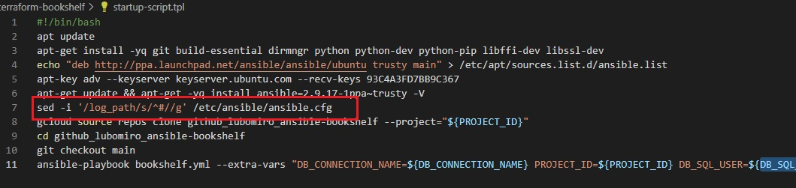
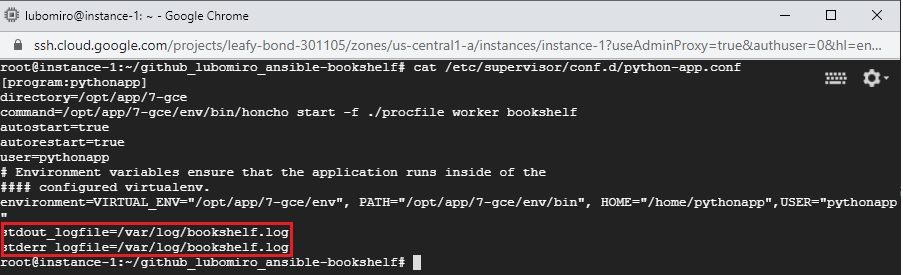
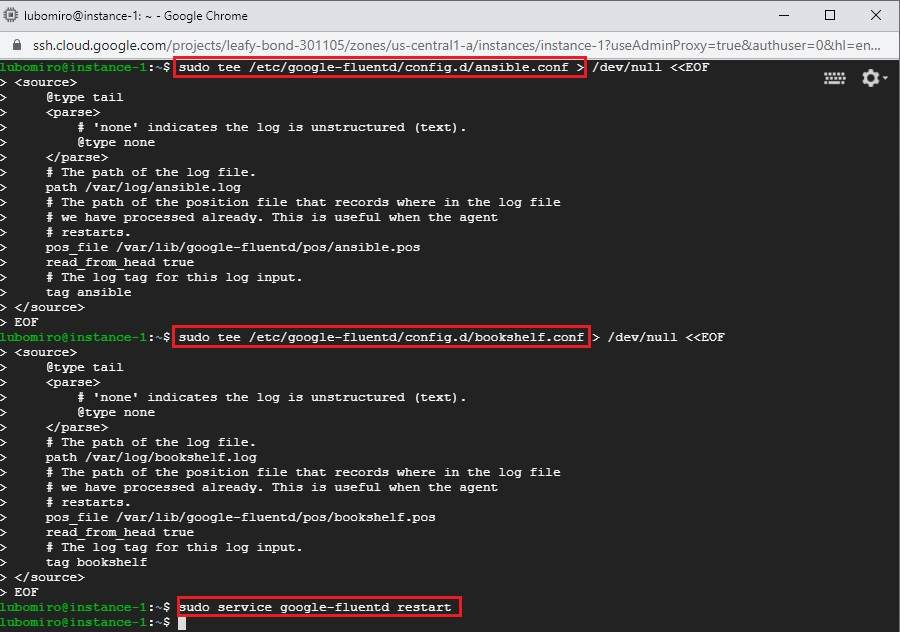
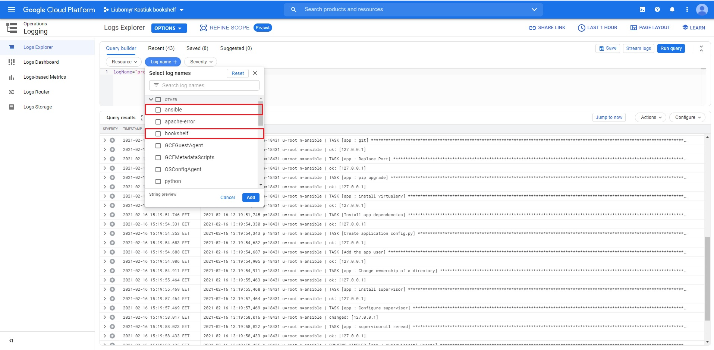
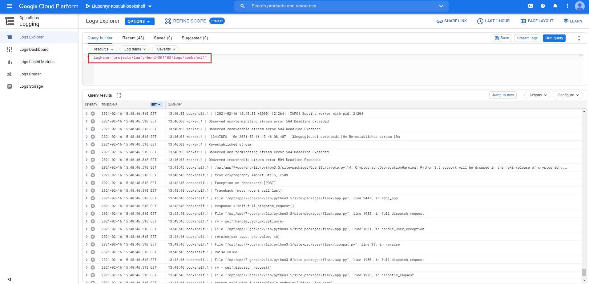
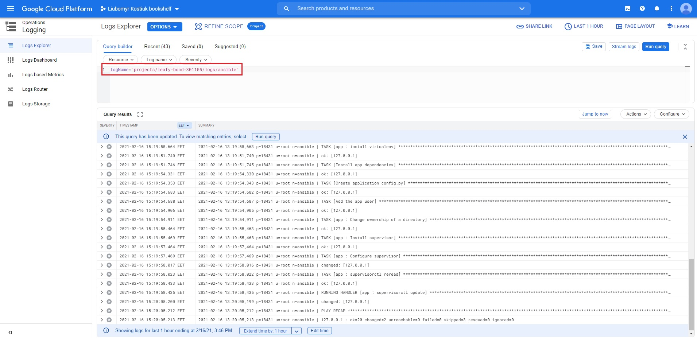

# Google Clouds Logging

## 1. Enable Ansible logging



## 2. Setup bookshelf app logging to bookshel.log file



## 3. Created new configuration files in the additional configuration directory /etc/google-fluentd/config.d and restart agent

```
sudo tee /etc/google-fluentd/config.d/ansible.conf > /dev/null <<EOF
<source>
    @type tail
    <parse>
        # 'none' indicates the log is unstructured (text).
        @type none
    </parse>
    # The path of the log file.
    path /var/log/ansible.log
    # The path of the position file that records where in the log file
    # we have processed already. This is useful when the agent
    # restarts.
    pos_file /var/lib/google-fluentd/pos/ansible.pos
    read_from_head true
    # The log tag for this log input.
    tag ansible
</source>
EOF

sudo tee /etc/google-fluentd/config.d/bookshelf.conf > /dev/null <<EOF
<source>
    @type tail
    <parse>
        # 'none' indicates the log is unstructured (text).
        @type none
    </parse>
    # The path of the log file.
    path /var/log/bookshelf.log
    # The path of the position file that records where in the log file
    # we have processed already. This is useful when the agent
    # restarts.
    pos_file /var/lib/google-fluentd/pos/bookshelf.pos
    read_from_head true
    # The log tag for this log input.
    tag bookshelf
</source>
EOF

```


## 4. Filter logs in Google Cloud Logging console




